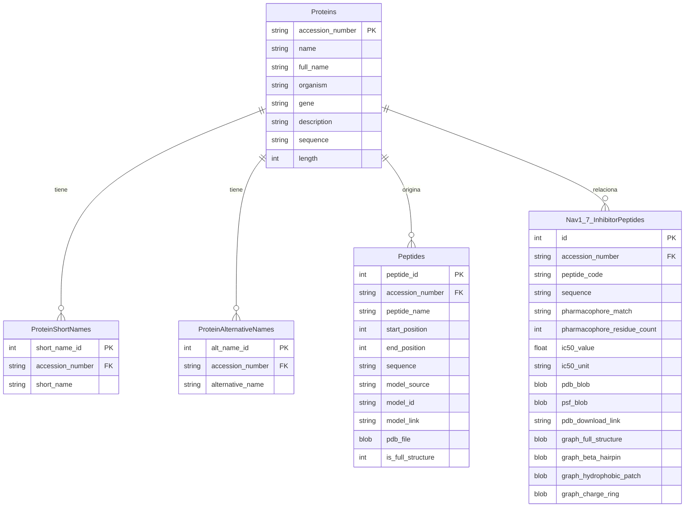

```mermaid

erDiagram
  Proteins ||--o{ ProteinShortNames : tiene
  Proteins ||--o{ ProteinAlternativeNames : tiene
  Proteins ||--o{ Peptides : origina
  Proteins ||--o{ Nav1_7_InhibitorPeptides : relaciona

  Proteins {
    string accession_number PK
    string name
    string full_name
    string organism
    string gene
    string description
    string sequence
    int    length
  }

  ProteinShortNames {
    int    short_name_id PK
    string accession_number FK
    string short_name
  }

  ProteinAlternativeNames {
    int    alt_name_id PK
    string accession_number FK
    string alternative_name
  }

  Peptides {
    int    peptide_id PK
    string accession_number FK
    string peptide_name
    int    start_position
    int    end_position
    string sequence
    string model_source
    string model_id
    string model_link
    blob   pdb_file
    int    is_full_structure
  }

  Nav1_7_InhibitorPeptides {
    int    id PK
    string accession_number FK
    string peptide_code
    string sequence
    string pharmacophore_match
    int    pharmacophore_residue_count
    float  ic50_value
    string ic50_unit
    blob   pdb_blob
    blob   psf_blob
    string pdb_download_link
    blob   graph_full_structure
    blob   graph_beta_hairpin
    blob   graph_hydrophobic_patch
    blob   graph_charge_ring
  }


```