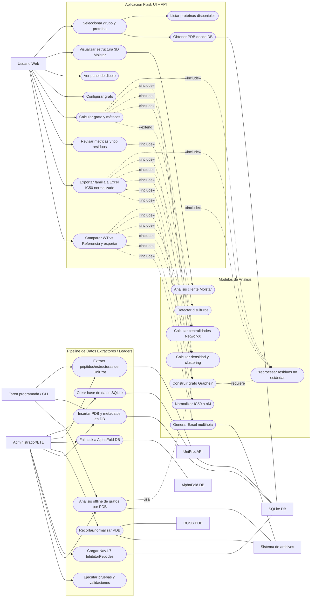

```mermaid
flowchart LR
  %% Actores principales
  A1[Usuario Web]
  A2[Administrador/ETL]
  A3[Tarea programada / CLI]
  SA[UniProt API]
  SB[AlphaFold DB]
  SC[RCSB PDB]
  SD[SQLite DB]
  SE[Sistema de archivos]

  %% Sistema: Aplicación Flask (UI + API)
  subgraph S1[Aplicación Flask UI + API]
    UC_Select([Seleccionar grupo y proteína])
    UC_FetchList([Listar proteínas disponibles])
    UC_GetPDB([Obtener PDB desde DB])
    UC_View3D([Visualizar estructura 3D Molstar])
    UC_ViewDipole([Ver panel de dipolo])
    UC_ConfigGraph([Configurar grafo])
    UC_CalcGraph([Calcular grafo y métricas])
    UC_ViewMetrics([Revisar métricas y top residuos])
    UC_ExportFamily([Exportar familia a Excel IC50 normalizado])
    UC_CompareWT([Comparar WT vs Referencia y exportar])
  end

  %% Sistema: Módulos de Análisis
  subgraph S2[Módulos de Análisis]
    UC_Preprocess([Preprocesar residuos no estándar])
    UC_BuildGraph([Construir grafo Graphein])
    UC_Centralities([Calcular centralidades NetworkX])
    UC_Density([Calcular densidad y clustering])
    UC_Disulf([Detectar disulfuros])
    UC_NormIC50([Normalizar IC50 a nM])
    UC_Excel([Generar Excel multihoja])
    UC_ClientAnalysis([Análisis cliente Molstar])
  end

  %% Sistema: Pipeline de Datos (Extractores / Loaders)
  subgraph S3[Pipeline de Datos Extractores / Loaders]
    UC_CreateDB([Crear base de datos SQLite])
    UC_ExtractUniProt([Extraer péptidos/estructuras de UniProt])
    UC_FallbackAF([Fallback a AlphaFold DB])
    UC_CutPDB([Recortar/normalizar PDB])
    UC_InsertDB([Insertar PDB y metadatos en DB])
    UC_LoadNav17([Cargar Nav1.7 InhibitorPeptides])
    UC_RecalcOffline([Análisis offline de grafos por PDB])
    UC_RunTests([Ejecutar pruebas y validaciones])
  end

  %% Relaciones actor -> casos de uso (UI)
  A1 --> UC_Select
  A1 --> UC_View3D
  A1 --> UC_ViewDipole
  A1 --> UC_ConfigGraph
  A1 --> UC_CalcGraph
  A1 --> UC_ViewMetrics
  A1 --> UC_ExportFamily
  A1 --> UC_CompareWT

  %% Relaciones internas UI
  UC_Select --> UC_FetchList
  UC_Select --> UC_GetPDB
  UC_GetPDB --- SD
  UC_View3D --> UC_ClientAnalysis

  %% UI -> Módulos de análisis
  UC_CalcGraph -. «include» .-> UC_Preprocess
  UC_CalcGraph -. «include» .-> UC_BuildGraph
  UC_CalcGraph -. «include» .-> UC_Centralities
  UC_CalcGraph -. «include» .-> UC_Density
  UC_CalcGraph -. «extend» .-> UC_Disulf
  UC_ViewMetrics -. «include» .-> UC_Centralities

  UC_ExportFamily -. «include» .-> UC_Preprocess
  UC_ExportFamily -. «include» .-> UC_BuildGraph
  UC_ExportFamily -. «include» .-> UC_Centralities
  UC_ExportFamily -. «include» .-> UC_Density
  UC_ExportFamily -. «include» .-> UC_NormIC50
  UC_ExportFamily -. «include» .-> UC_Excel

  UC_CompareWT -. «include» .-> UC_Preprocess
  UC_CompareWT -. «include» .-> UC_BuildGraph
  UC_CompareWT -. «include» .-> UC_Centralities
  UC_CompareWT -. «include» .-> UC_Density
  UC_CompareWT -. «include» .-> UC_NormIC50
  UC_CompareWT -. «include» .-> UC_Excel

  %% Actores -> Pipeline de datos
  A2 --> UC_CreateDB
  A2 --> UC_ExtractUniProt
  A2 --> UC_FallbackAF
  A2 --> UC_CutPDB
  A2 --> UC_InsertDB
  A2 --> UC_LoadNav17
  A2 --> UC_RecalcOffline
  A2 --> UC_RunTests

  A3 --> UC_ExtractUniProt
  A3 --> UC_InsertDB
  A3 --> UC_RecalcOffline

  %% Pipeline -> Sistemas externos
  UC_ExtractUniProt --- SA
  UC_FallbackAF --- SB
  UC_CutPDB --- SC
  UC_CutPDB --- SE
  UC_InsertDB --- SD
  UC_CreateDB --- SD
  UC_LoadNav17 --- SD
  UC_RecalcOffline -. usa .- UC_BuildGraph
  UC_RecalcOffline --- SE

  %% Notas de dependencias
  UC_BuildGraph -. requiere .- UC_Preprocess
  UC_Excel --- SE
```