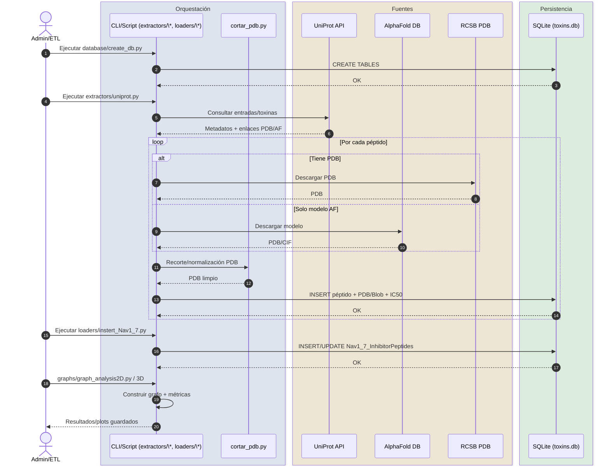

```mermaid
sequenceDiagram
  autonumber
  actor Admin as Admin/ETL

  %% === Capas / bloques ===
  box rgba(220,235,255,0.45) Orquestación
    participant CLI as CLI/Script (extractors/\*, loaders/\*)
    participant Tools as cortar_pdb.py
  end

  box rgba(255,240,200,0.45) Fuentes
    participant UniProt as UniProt API
    participant AFDB as AlphaFold DB
    participant RCSB as RCSB PDB
  end

  box rgba(220,255,220,0.45) Persistencia
    participant DB as SQLite (toxins.db)
  end
  %% ========================

  %% Crear base de datos
  Admin->>CLI: Ejecutar database/create_db.py
  CLI->>DB: CREATE TABLES
  DB-->>CLI: OK

  %% Pipeline UniProt/AlphaFold
  Admin->>CLI: Ejecutar extractors/uniprot.py
  CLI->>UniProt: Consultar entradas/toxinas
  UniProt-->>CLI: Metadatos + enlaces PDB/AF
  loop Por cada péptido
    alt Tiene PDB
      CLI->>RCSB: Descargar PDB
      RCSB-->>CLI: PDB
    else Solo modelo AF
      CLI->>AFDB: Descargar modelo
      AFDB-->>CLI: PDB/CIF
    end
    CLI->>Tools: Recorte/normalización PDB
    Tools-->>CLI: PDB limpio
    CLI->>DB: INSERT péptido + PDB/Blob + IC50
    DB-->>CLI: OK
  end

  %% Carga específica Nav1.7
  Admin->>CLI: Ejecutar loaders/instert_Nav1_7.py
  CLI->>DB: INSERT/UPDATE Nav1_7_InhibitorPeptides
  DB-->>CLI: OK

  %% Análisis offline (opcional)
  Admin->>CLI: graphs/graph_analysis2D.py / 3D
  CLI->>CLI: Construir grafo + métricas
  CLI-->>Admin: Resultados/plots guardados
```