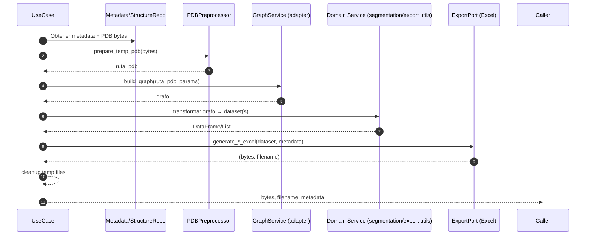

# Carpeta `application`

Esta capa implementa la ORQUESTACIÓN de casos de uso siguiendo un enfoque de arquitectura limpia / puertos y adaptadores. No contiene lógica de infraestructura (IO de disco, librerías externas concretas) ni detalles de framework web; sólo coordina dependencias a través de interfaces (ports) y devuelve estructuras simples (dict, DTO, bytes de un Excel, etc.).

## Objetivos de la capa

- Normalizar parámetros y value objects antes de delegar a servicios de infraestructura.
- Encapsular cada acción del dominio de análisis de toxinas en un *Use Case* único y testeable.
- Aislar cambios en librerías (Graphein, exportadores Excel, preprocesado PDB) detrás de *ports*.
- Facilitar pruebas unitarias mediante inyección de dobles (fakes / mocks) que implementen los `Protocol`.

## Estructura

```
application/
  dto/
    graph_dto.py              # DTOs de solicitud y respuesta para construcción de grafos
  ports/                      # Definiciones de contratos (Protocol) que deben implementar los adaptadores infra
    export_port.py            # Operaciones de exportación (Excel comparativo, familia, individual)
    graph_service_port.py     # Construcción y métricas de grafos
    pdb_preprocessor_port.py  # Preparación de PDB temporal (normalización + archivo)
    repositories.py           # Acceso a datos (pdb/psf, metadata, familias)
    temp_file_port.py         # Limpieza / gestión de archivos temporales
  use_cases/
    build_protein_graph.py    # Construir grafo y retornar propiedades
    calculate_dipole.py       # Calcular momento dipolar (usa adaptador de dipolo)
    export_atomic_segments.py # Exportar segmentación atómica (granularity atom)
    export_family_reports.py  # Exportar lote de toxinas de una familia (residuos o segmentos)
    export_residue_report.py  # Exportar reporte por residuo de una toxina específica
    export_wt_comparison.py   # Comparar WT vs referencia (residuos o segmentos)
    list_peptides.py          # Listar IDs + nombres por fuente (toxinas/nav1_7)
```

## DTOs (`dto/graph_dto.py`)

```python
@dataclass
class GraphRequestDTO:
  source: str
  pid: int
  granularity: str = 'CA'
  distance_threshold: float = 10.0

@dataclass
class GraphResponseDTO:
    properties: Dict[str, Any]
    meta: Dict[str, Any]
```

Uso: Cuando la interfaz HTTP necesita empaquetar parámetros de entrada / salida de construcción de grafo de forma estable. (Algunos use cases trabajan directamente con sus propios `Input` dataclasses, pero este DTO ofrece una especificación mínima reutilizable.)

## Ports (Protocols)

Los *ports* son contratos abstractos. La infraestructura provee adaptadores concretos (por ejemplo: `GrapheinGraphAdapter`, `ExcelExportAdapter`, repositorios SQLite, etc.). Esto permite que los use cases no dependan de implementaciones específicas.

### `export_port.ExportPort`
| Método | Propósito | Retorno |
|--------|----------|---------|
| `generate_single_toxin_excel(residue_data, metadata, toxin_name, source)` | Crear Excel para una toxina (residuos) | `(bytes, filename)` |
| `generate_family_excel(toxin_dataframes, family_prefix, metadata, export_type, granularity)` | Multi‑hoja por familia | `(bytes, filename)` |
| `generate_comparison_excel(comparison_dataframes, wt_family, metadata, export_type, granularity)` | WT vs referencia (y opcional resumen) | `(bytes, filename)` |

### `graph_service_port.GraphServicePort`
| Método | Descripción |
|--------|-------------|
| `build_graph(pdb_path, granularity, distance_threshold)` | Construye un grafo (normalmente NetworkX) desde un PDB ya preprocesado. |
| `compute_metrics(G)` | Devuelve dict con métricas agregadas (nodos, aristas, densidad, clustering, centralidades, etc.). |

### `pdb_preprocessor_port.PDBPreprocessorPort`
| Método | Descripción |
|--------|-------------|
| `prepare_temp_pdb(pdb_bytes)` | Normaliza el contenido y genera un archivo temporal PDB; devuelve ruta. |
| `cleanup(paths)` | Elimina archivos temporales generados. |

### `repositories.py`
Separa responsabilidades lógicas (pueden ser implementadas por una o varias clases):

| Interfaz | Métodos clave | Uso en use cases |
|----------|---------------|------------------|
| `ToxinRepository` | `list_toxins()`, `list_nav1_7()` | `ListPeptides` |
| `StructureRepository` | `get_pdb(source, pid)`, `get_psf(source, pid)` | `calculate_dipole`, exports, etc. |
| `MetadataRepository` | `get_complete_toxin_data`, `get_family_toxins`, `get_wt_toxin_data` | Todos los exports, dipolo, informes |
| `FamilyRepository` | `list_family_toxins`, `list_family_peptides` | `ExportFamilyReports` |

### `temp_file_port.TempFilePort`
Interface mínima para limpieza de archivos temporales cuando la lógica de creación está en otro componente.

## Use Cases

Cada *use case* define: un dataclass de entrada + una clase con método `execute()`. Devuelven estructuras simples para que la capa de interfaz decida cómo serializar.

### 1. `build_protein_graph.BuildProteinGraph`
**Input:** `BuildProteinGraphInput(pdb_path, granularity, distance_threshold)`

Pasos:
1. Normalizar value objects a primitivos (`granularity.value` etc.).
2. Llamar `graph_port.build_graph(...)`.
3. Calcular métricas con `graph_port.compute_metrics(G)`.
4. Retornar `{ "graph": G, "properties": props }` (la interfaz suele filtrar el objeto grafo antes de exponerlo).

Usos típicos: preparación previa a export o visualización JSON.

### 2. `calculate_dipole.CalculateDipole`
**Input:** `CalculateDipoleInput(source, pid)`

Pasos:
1. Obtener `pdb_bytes` y opcional `psf_bytes` del repositorio de estructuras.
2. Generar archivos temporales vía preprocesador.
3. Delegar a `dipole.calculate_dipole_from_files(pdb_path, psf_path)`.
4. Retornar `{ success: True, dipole: {...} }` o error.
5. Limpieza garantizada en `finally`.

### 3. `export_atomic_segments.ExportAtomicSegments`
**Input:** `ExportAtomicSegmentsInput(pid, granularity='atom', distance_threshold)`

Validación: exige granularidad `atom`.

Pasos:
1. Obtener metadata completa (para nombre e IC50) y PDB.
2. Construir grafo (adapter dinámico: intenta `app.services.graph_analyzer`, fallback a `GraphExportService`).
3. Llamar a `agrupar_por_segmentos_atomicos(G, gran)` (servicio de dominio) → DataFrame.
4. Construir metadata (nodos, aristas, densidad, nº segmentos, parámetros).
5. Delegar a `ExcelExportAdapter.generate_atomic_segments_excel(...)`.
6. Retornar `(bytes_excel, filename, metadata)`.

### 4. `export_family_reports.ExportFamilyReports`
**Input:** `ExportFamilyInput(family_prefix, export_type, granularity, distance_threshold)`

Pasos:
1. Obtener lista de toxinas de la familia (id, código, IC50 y unidad).
2. Iterar: construir grafo → generar dataset:
   - `residues`: `ExportService.prepare_residue_export_data` → DataFrame.
   - `segments_atomicos`: `agrupar_por_segmentos_atomicos`.
3. Insertar métricas por toxina en metadata (nodos, aristas, densidad).
4. Agregar IC50 a metadata con claves individuales.
5. Llamar `generate_family_excel`.
6. Error si ninguna toxina produjo datos válidos.

### 5. `export_residue_report.ExportResidueReport`
**Input:** `ExportResidueReportInput(source, pid, granularity, distance_threshold)`

Pasos:
1. Cargar metadata + PDB.
2. Preprocesar y construir grafo.
3. Generar `residue_data` con `ExportService.prepare_residue_export_data`.
4. Construir metadata estandarizada con `ExportService.create_metadata`.
5. Exportar `generate_single_toxin_excel`.

### 6. `export_wt_comparison.ExportWTComparison`
**Input:** `ExportWTComparisonInput(wt_family, export_type, granularity, distance_threshold, reference_path)`

Pasos:
1. Mapear `wt_family` a código WT (tabla interna `wt_mapping`).
2. Recuperar registro WT + PDB.
3. Leer PDB de referencia (archivo local). Validar existencia.
4. Procesar ambos (y potencialmente variantes futuras) mediante `_process_single`:
   - Construcción grafo + dataset (residuos o segmentos) etiquetando `Tipo` = WT_Target | Reference.
5. (Opcional) `Resumen_Comparativo` si `ExportService.create_summary_comparison_dataframe` existe.
6. Construir metadata global y exportar con `generate_comparison_excel`.

### 7. `list_peptides.ListPeptides`
**Input:** `ListPeptidesInput(source)`

Pasos: Delegar a `ToxinRepository.list_toxins()` o `.list_nav1_7()` según fuente. Retorna lista `(id, nombre)`.

## Flujo Interno Genérico de un Export Use Case



## Integración con otras capas

La capa `interfaces` (controladores Flask) hace:

1. Parsear query/body → construir `Input` dataclass apropiado.
2. Invocar `use_case.execute(input)`.
3. Serializar resultado (JSON o `send_file` para Excel).

La capa `infrastructure` provee las implementaciones concretas de:

- Repositorios SQLite (metadata / estructuras).
- Adaptadores Graphein (`GraphExportService` como `GraphAnalyzer`).
- Adaptadores de exportación (`ExcelExportAdapter`, `ExportService`).
- Preprocesado PDB (`PDBPreprocessorAdapter`).
- Servicios FS temporales (`TempFileService`).
- Cálculo de dipolo (`DipoleAdapter`).

## Manejo de Parámetros y Value Objects

Algunos use cases permiten recibir directamente instancias de `Granularity`, `SequenceSeparation`, `DistanceThreshold`; en su ausencia aceptan primitivas y las normalizan. Esto admite validaciones previas en la capa dominio sin forzar a la interfaz a conocer detalles internos.

## Errores y Consideraciones

- `FileNotFoundError`: PDB inexistente.
- `ValueError`: Parámetros inválidos (ej. granularidad ≠ 'atom' cuando se requieren segmentos atómicos).
- `RuntimeError`: Grafo vacío o sin datos exportables.
- Limpieza en `finally`: Asegura que archivos temporales se eliminen siempre.

Recomendado: estandarizar excepciones de dominio (p.ej. `DomainError`, `NotFoundDomainError`) para respuestas HTTP uniformes.

