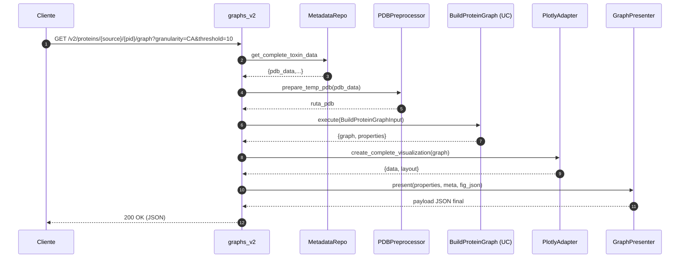

# Carpeta `interfaces`

Expone el sistema al exterior (HTTP) y contiene los recursos web (templates + JS + CSS). Implementa la capa más externa de la arquitectura limpia: **controladores Flask (adapters de entrada)** y **presenters** que formatean la respuesta para el cliente.

## Objetivos
- Recibir peticiones HTTP, parsear parámetros y delegar en casos de uso (`application`).
- Serializar resultados (JSON / Excel / HTML) con un formato estable para el frontend.
- Servir páginas iniciales (SSR mínima) y activos estáticos (Mol*, scripts de análisis, estilos).
- Aislar la lógica de presentación (presenters) de la lógica de negocio.

## Estructura

```
interfaces/
  http/
    flask/
      app.py                     # Composition root: crea Flask, inyecta dependencias y registra blueprints v2
      controllers/
        graphs_controller.py     # Endpoint de grafo y visualización Plotly JSON
        toxins_controller.py     # Listado de péptidos (toxinas / nav1_7)
        legacy_compat_controller.py (si existe) # Rutas alias (opcional)
        v2/
          export_controller.py   # Exportaciones (residuos, segmentos, familia, comparación WT)
          dipole_controller.py   # Cálculo dipolo individual
          families_controller.py # Listar familias, péptidos por familia y dipolos por familia
          metadata_controller.py # Nombre/display de toxina
          structures_controller.py # Acceso plano a PDB/PSF
          toxins_filter_controller.py # Filtro por motivos (gaps Cys-Cys)
          pages_controller.py    # Páginas HTML (viewer, dipolo familias)
          motifs_controller.py   # Placeholder (vacío actualmente)
      presenters/
        graph_presenter.py       # Ensambla payload de grafo + estadísticas
        export_presenter.py      # Metadatos de archivos Excel
        dipole_presenter.py      # Resultado dipolo estructurado
      web/
        templates/               # Jinja2 (viewer.html, dipole_families.html, toxin_filter.html, motifs.html)
        static/
          js/                    # Lógica de UI (Mol*, grafos, export feedback, filtros, dipolos)
          css/                   # Estilos
```

## `app.py` (Composition Root)
1. Configura carpetas de plantillas y estáticos.
2. Carga configuración (`load_app_config`) con rutas de DB, PDB, PSF, referencia WT.
3. Instancia repositorios SQLite y adaptadores (graphein, export, PDB, dipolo, temp files).
4. Crea e inyecta casos de uso (build graph, dipole, export, list peptides...).
5. Registra blueprints v2 mediante funciones `configure_*_dependencies` para DI manual.
6. Expone `/v2/health` (diagnóstico: blueprints registrados y config).
7. (Opcional) Activa rutas legacy si `LEGACY_ALIASES_ENABLED=1`.

## Blueprints y Endpoints Principales (v2)

| Blueprint | Ruta base / ejemplos | Propósito |
|-----------|----------------------|-----------|
| `graphs_v2` | `/v2/proteins/<source>/<pid>/graph` | Construir grafo + métricas + JSON Plotly | 
| `export_v2` | `/v2/export/residues/...`, `/v2/export/family/...`, `/v2/export/segments_atomicos/...`, `/v2/export/wt_comparison/...` | Generar Excel (residuos, segmentos, familia, comparación WT) |
| `dipole_v2` | `POST /v2/dipole/<source>/<pid>` | Calcular momento dipolar (nav1_7) |
| `families_v2` | `/v2/families`, `/v2/family-peptides/<fam>`, `/v2/family-dipoles/<fam>` | Listar familias, péptidos y dipolos en lote |
| `metadata_v2` | `/v2/metadata/toxin_name/<source>/<pid>` | Obtener nombre de toxina |
| `structures_v2` | `/v2/structures/<source>/<pid>/pdb`, `/v2/structures/<source>/<pid>/psf` | Recuperar contenido PDB/PSF en texto |
| `toxins_v2` | `/v2/peptides?source=...` | Listar IDs + nombres por fuente |
| `toxin_filter` | `/v2/toxin_filter` | Buscar toxinas (motivo gap Cys) |
| `pages_v2` | `/` , `/dipole_families` | Páginas HTML (SSR mínima) |

### Parámetros Relevantes (ejemplos)
- `long` (int): separación secuencial mínima (default 5).
- `threshold` (float): distancia para aristas (default 10.0).
- `granularity` (`CA` | `atom`): niveles del grafo.
- `export_type` (`residues` | `segments_atomicos`).
- `raw=1` (graphs): retorna payload minimizado (debug).
- `section=props|fig|all`: filtrar secciones del payload de grafo.
- `format=json` (export): devuelve sólo metadatos y tamaño en lugar del archivo.

## Presenters

| Presenter | Rol |
|-----------|-----|
| `GraphPresenter` | Ensambla propiedades del grafo + layout Plotly + top5 centralidades + resumen estadístico. Normaliza numpy a tipos serializables. |
| `ExportPresenter` | Devuelve metadatos de export (filename, size, content_type) para endpoints con `format=json`. |
| `DipolePresenter` | Envuelve resultado dipolar junto a `meta` (source, pid). |

## Flujo de Construcción de Grafo (HTTP → JSON)



## Seguridad y Robustez
- Validación básica de parámetros vía Value Objects (granularity / thresholds) en export y graph.
- Limpieza de archivos temporales en bloques `finally` (graphs_controller, export use cases).
- Nombres Unicode preservados (`JSON_AS_ASCII = False`).
- Fallbacks si Graphein visualización falla (visualizador retorna layout propio en adapter de infraestructura).

## Frontend (`web/`)

| Archivo JS | Función Principal |
|------------|-------------------|
| `viewer.js` | Inicializa selects, carga listas, solicita grafo y PDB, integra Mol* |
| `graph_viewer.js` | Pestañas / panel de métricas cliente |
| `molstar_analyzer.js` | Análisis ligero (distancias, disulfuros, centralidades aproximadas) en cliente |
| `export_feedback.js` | Estados y mensajes de progreso para exportaciones |
| `dual_view_manager.js` | Gestión de vistas (estructura / análisis) y dipolo |
| `dipole_family_analysis.js` | UI para análisis de dipolos por familia |
| `motifs.js` | Interacciones UI de motivos (placeholder si se expande) |
| `toxin_filter.js` | Consumo API de filtro (`/v2/toxin_filter`) y render tabla |

CSS: `viewer.css`, `dipole_families.css` controlan layout responsivo y paneles de análisis.

Templates Jinja2:
- `viewer.html`: Página principal (selects, visor 3D, panel métricas, export UI).
- `dipole_families.html`: Visualización compartida de dipolos por familia.
- `toxin_filter.html`: Form para búsqueda por motivo.
- `motifs.html`: Plantilla base (extensible) para motivos.

## DI (Inyección de Dependencias)
Cada controlador v2 define una función `configure_*_dependencies(...)` que reasigna variables módulo-globales (adaptadores / repos / use cases). `app.py` la llama en el arranque, permitiendo:
- Tests que inyectan repos/fakes.
- Sustitución de implementaciones (cache, mocks) sin modificar controladores.

## Errores y Respuestas Estándar
- 404 cuando no existe PDB/PSF.
- 400 en validaciones (p.ej. granularidad incorrecta para segmentos atómicos).
- 500 para excepciones no controladas (se devuelve `{"error": "mensaje"}`).
